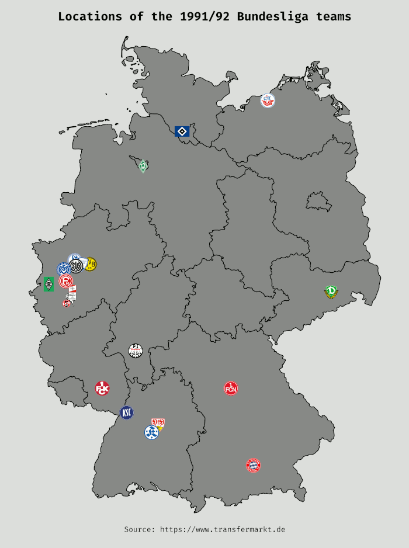

# Map of the Bundesliga teams from 1991 to 2021

This animated map (gif) shows all Bundesliga teams from 1991 to 2021.

If you want to see the single images for each season you have to go into the img/ folder.

## Tools used:

- [Beautiful Soup](https://www.crummy.com/software/BeautifulSoup/)
- [Requests](https://docs.python-requests.org/en/master/)
- [Pandas](https://pandas.pydata.org/)
- [Geopandas](https://geopandas.org/)
- [Matplotlib](https://matplotlib.org/)

## Data source: https://www.transfermarkt.de

## About this repository

I created the graph with the Jupyter Notebook you see in this repository. You can find the same code as a normal Python file in main.py.